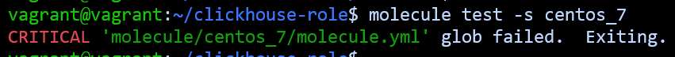

# Домашнее задание к занятию "08.05 Тестирование Roles"

## Подготовка к выполнению
1. Установите molecule: `pip3 install "molecule==3.5.2"`

2. Выполните `docker pull aragast/netology:latest` -  это образ с podman, tox и несколькими пайтонами (3.7 и 3.9) внутри

## Основная часть

Ваша цель — настроить тестирование ваших ролей. 

Задача — сделать сценарии тестирования для vector. 

Ожидаемый результат — все сценарии успешно проходят тестирование ролей.

### Molecule

1. Запустите  `molecule test -s centos_7` внутри корневой директории clickhouse-role, посмотрите на вывод команды. Данная команда может отработать с ошибками, это нормально. Наша цель - посмотреть как другие в реальном мире используют молекулу.

2. Перейдите в каталог с ролью vector-role и создайте сценарий тестирования по умолчанию при помощи `molecule init scenario --driver-name docker`.

3. Добавьте несколько разных дистрибутивов (centos:8, ubuntu:latest) для инстансов и протестируйте роль, исправьте найденные ошибки, если они есть.

Для Ubuntu создала отдельный сценарий, пришлось переписать таску с использованием rescue

4. Добавьте несколько assert в verify.yml-файл для  проверки работоспособности vector-role (проверка, что конфиг валидный, проверка успешности запуска и др.). 

5. Запустите тестирование роли повторно и проверьте, что оно прошло успешно.

6. Добавьте новый тег на коммит с рабочим сценарием в соответствии с семантическим версионированием.

### Tox

1. Добавьте в директорию с vector-role файлы из [директории](./example).

2. Запустите `docker run --privileged=True -v <path_to_repo>:/opt/vector-role -w /opt/vector-role -it aragast/netology:latest /bin/bash`, где path_to_repo — путь до корня репозитория с vector-role на вашей файловой системе.

3. Внутри контейнера выполните команду `tox`, посмотрите на вывод.
4. Создайте облегчённый сценарий для `molecule` с драйвером `molecule_podman`. Проверьте его на исполнимость.
5. Пропишите правильную команду в `tox.ini`, чтобы запускался облегчённый сценарий.
6. Запустите команду `tox`. Убедитесь, что всё отработало успешно.
Не смогла победить ошибку, ни в полном сценарии, ни на центосе, ни на убунту

7. Добавьте новый тег на коммит с рабочим сценарием в соответствии с семантическим версионированием.

После выполнения у вас должно получится два сценария molecule и один tox.ini файл в репозитории.
Не забудьте указать в ответе теги решений Tox и Molecule заданий.
В качестве решения пришлите ссылку на ваш репозиторий и скриншоты этапов выполнения задания.
## Необязательная часть

1. Проделайте схожие манипуляции для создания роли LightHouse.
2. Создайте сценарий внутри любой из своих ролей, который умеет поднимать весь стек при помощи всех ролей.
3. Убедитесь в работоспособности своего стека. Создайте отдельный verify.yml, который будет проверять работоспособность интеграции всех инструментов между ними.
4. Выложите свои roles в репозитории.

В качестве решения пришлите ссылки и скриншоты этапов выполнения задания.

---

### Как оформить решение задания

Выполненное домашнее задание пришлите в виде ссылки на .md-файл в вашем репозитории.
