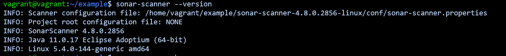
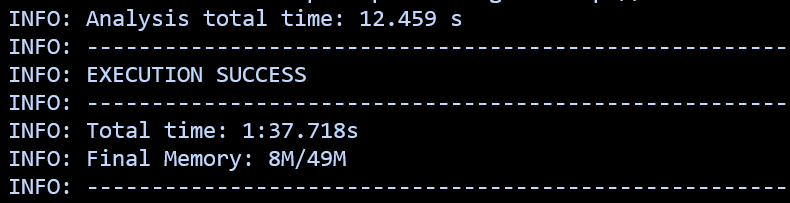
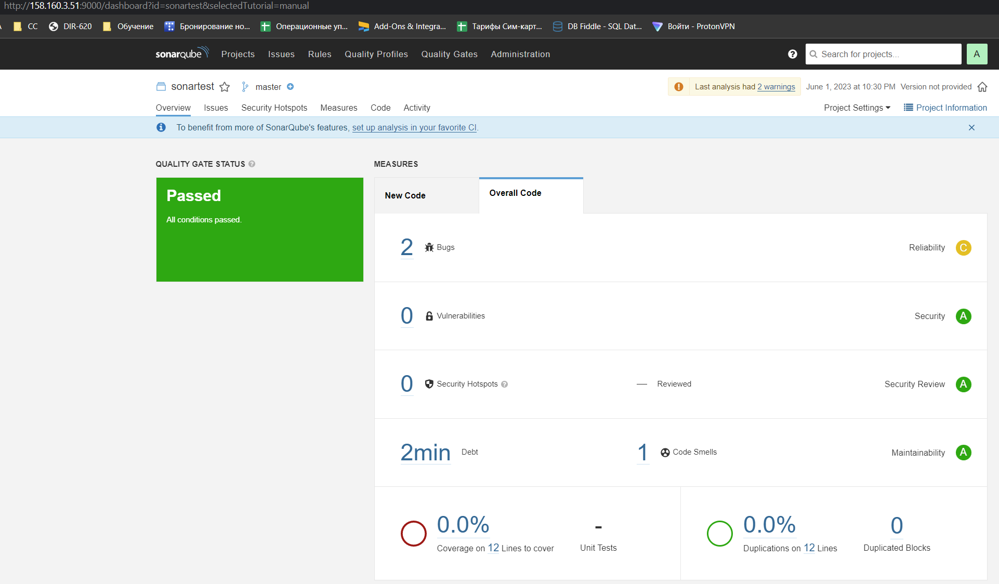
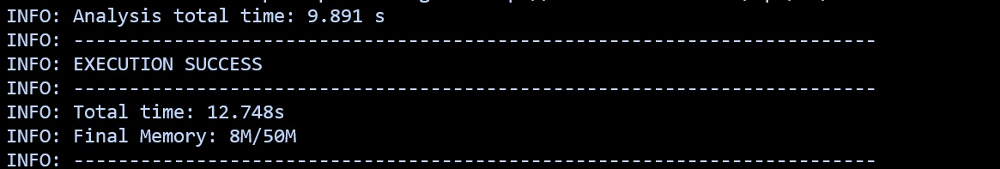
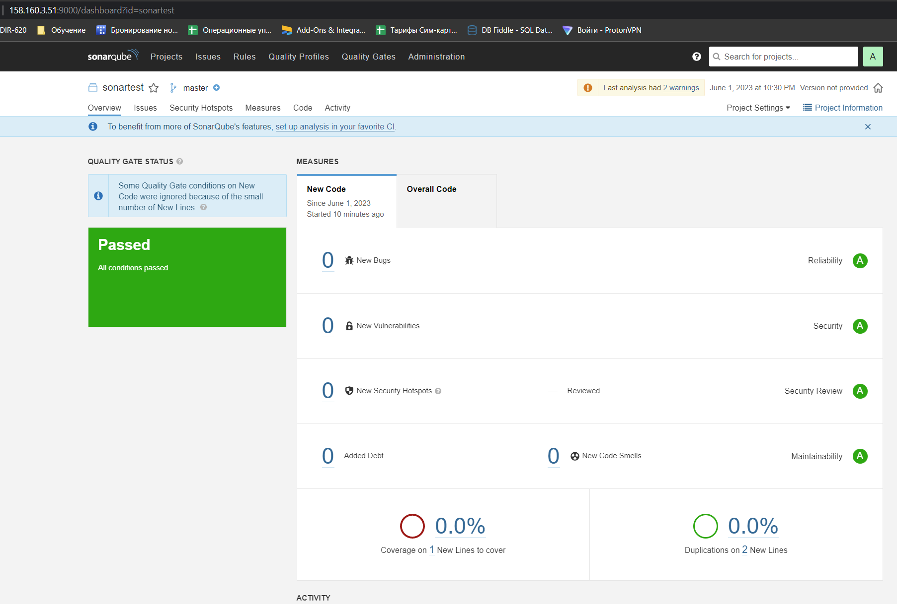
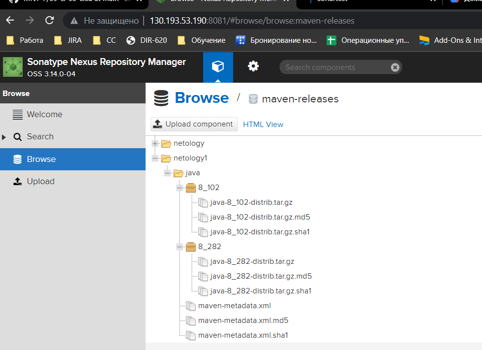
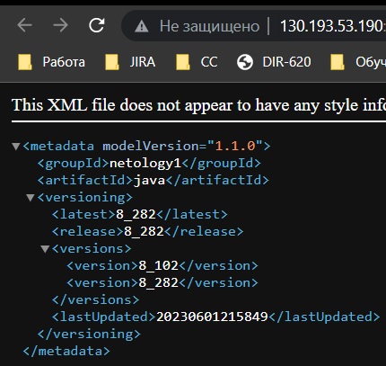
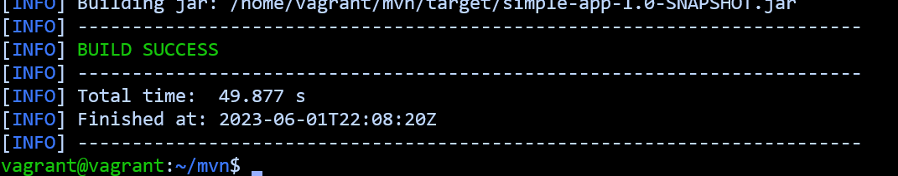
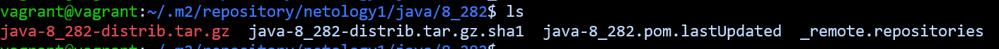

# Домашнее задание к занятию "09.03 CI\CD"

## Подготовка к выполнению

1. Создаём 2 VM в yandex cloud со следующими параметрами: 2CPU 4RAM Centos7(остальное по минимальным требованиям)
2. Прописываем в [inventory](./infrastructure/inventory/cicd/hosts.yml) [playbook'a](./infrastructure/site.yml) созданные хосты
3. Добавляем в [files](./infrastructure/files/) файл со своим публичным ключом (id_rsa.pub). Если ключ называется иначе - найдите таску в плейбуке, которая использует id_rsa.pub имя и исправьте на своё
4. Запускаем playbook, ожидаем успешного завершения
5. Проверяем готовность Sonarqube через [браузер](http://localhost:9000)
6. Заходим под admin\admin, меняем пароль на свой
7.  Проверяем готовность Nexus через [бразуер](http://localhost:8081)
8. Подключаемся под admin\admin123, меняем пароль, сохраняем анонимный доступ

## Знакомоство с SonarQube

### Основная часть

1. Создаём новый проект, название произвольное
2. Скачиваем пакет sonar-scanner, который нам предлагает скачать сам sonarqube
3. Делаем так, чтобы binary был доступен через вызов в shell (или меняем переменную PATH или любой другой удобный вам способ)
4. Проверяем `sonar-scanner --version`

5. Запускаем анализатор против кода из директории [example](./example) с дополнительным ключом `-Dsonar.coverage.exclusions=fail.py`

6. Смотрим результат в интерфейсе

7. Исправляем ошибки, которые он выявил(включая warnings)
8. Запускаем анализатор повторно - проверяем, что QG пройдены успешно

9. Делаем скриншот успешного прохождения анализа, прикладываем к решению ДЗ

## Знакомство с Nexus

### Основная часть

1. В репозиторий `maven-public` загружаем артефакт с GAV параметрами:
   1. groupId: netology
   2. artifactId: java
   3. version: 8_282
   4. classifier: distrib
   5. type: tar.gz
2. В него же загружаем такой же артефакт, но с version: 8_102
3. Проверяем, что все файлы загрузились успешно

Т.к. накосячила с загрузкой артефакта в netology, использую groupId: netology1
4. В ответе присылаем файл `maven-metadata.xml` для этого артефекта

### Знакомство с Maven

### Подготовка к выполнению

1. Скачиваем дистрибутив с [maven](https://maven.apache.org/download.cgi)
2. Разархивируем, делаем так, чтобы binary был доступен через вызов в shell (или меняем переменную PATH или любой другой удобный вам способ)
3. Удаляем из `apache-maven-<version>/conf/settings.xml` упоминание о правиле, отвергающем http соединение( раздел mirrors->id: my-repository-http-unblocker)
4. Проверяем `mvn --version`
5. Забираем директорию [mvn](./mvn) с pom

### Основная часть

1. Меняем в `pom.xml` блок с зависимостями под наш артефакт из первого пункта задания для Nexus (java с версией 8_282)
2. Запускаем команду `mvn package` в директории с `pom.xml`, ожидаем успешного окончания

3. Проверяем директорию `~/.m2/repository/`, находим наш артефакт

4. В ответе присылаем исправленный файл `pom.xml`

---

### Как оформить ДЗ?

Выполненное домашнее задание пришлите ссылкой на .md-файл в вашем репозитории.

---
