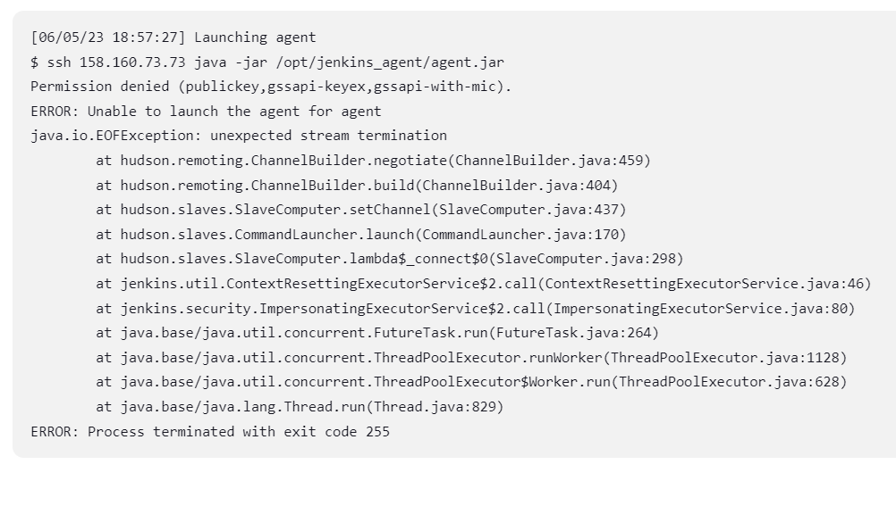
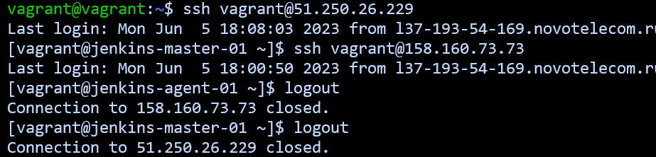
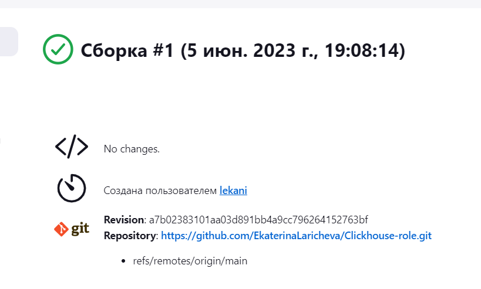
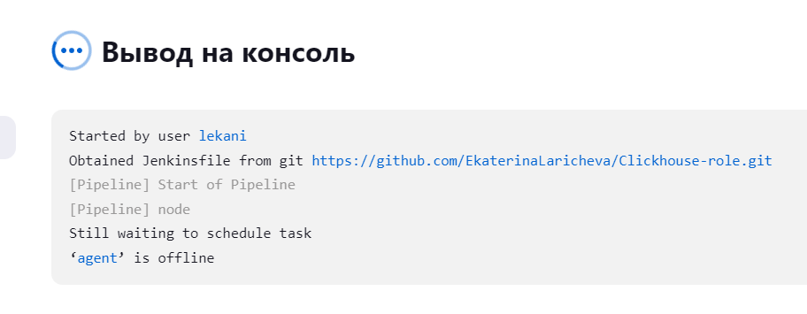
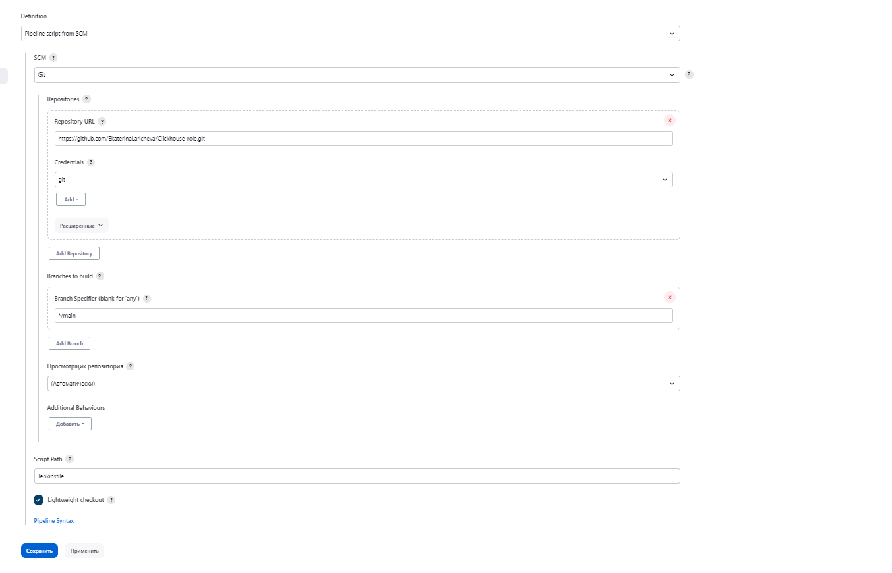
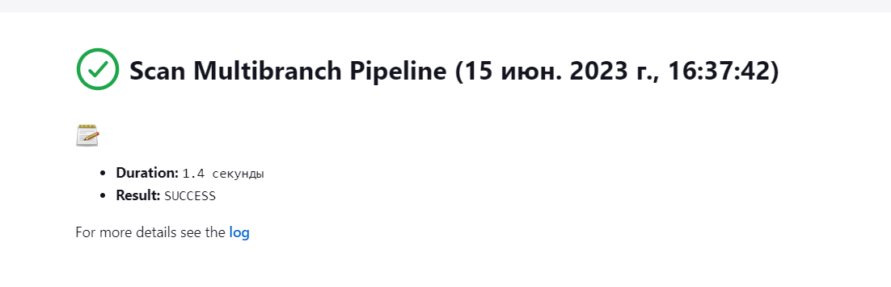
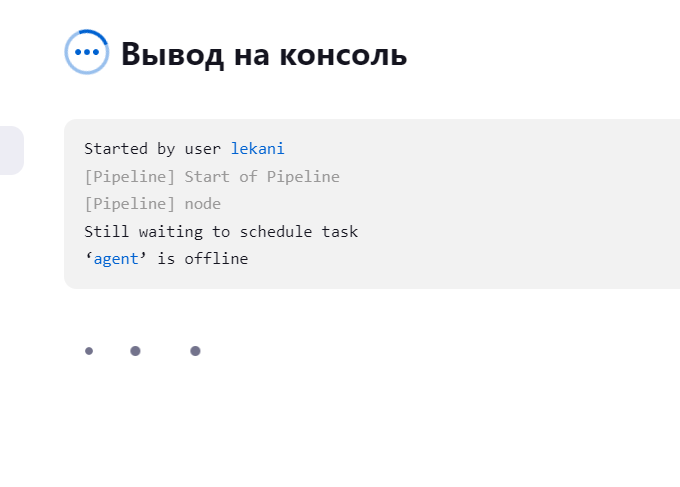

# Домашнее задание к занятию "09.04 Jenkins"

## Подготовка к выполнению

1. Создать 2 VM: для jenkins-master и jenkins-agent.
2. Установить jenkins при помощи playbook'a.
3. Запустить и проверить работоспособность.
4. Сделать первоначальную настройку.
 Не могу победить ошибку

 

Я добавила ssh ключи и могу в терминале с мастера зйти на агента. Но в дженкинс все равно сохраняется ошибка

Возможно, вы можете подсказать как это исправить

## Основная часть

1. Сделать Freestyle Job, который будет запускать `molecule test` из любого вашего репозитория с ролью.

Started by user lekani
Running as SYSTEM
Building on the built-in node in workspace /var/lib/jenkins/workspace/molecule
The recommended git tool is: NONE
No credentials specified
Cloning the remote Git repository
Cloning repository https://github.com/EkaterinaLaricheva/Clickhouse-role.git
 > git init /var/lib/jenkins/workspace/molecule # timeout=10
Fetching upstream changes from https://github.com/EkaterinaLaricheva/Clickhouse-role.git
 > git --version # timeout=10
 > git --version # 'git version 1.8.3.1'
 > git fetch --tags --progress https://github.com/EkaterinaLaricheva/Clickhouse-role.git +refs/heads/*:refs/remotes/origin/* # timeout=10
 > git config remote.origin.url https://github.com/EkaterinaLaricheva/Clickhouse-role.git # timeout=10
 > git config --add remote.origin.fetch +refs/heads/*:refs/remotes/origin/* # timeout=10
Avoid second fetch
 > git rev-parse refs/remotes/origin/main^{commit} # timeout=10
Checking out Revision a7b02383101aa03d891bb4a9cc796264152763bf (refs/remotes/origin/main)
 > git config core.sparsecheckout # timeout=10
 > git checkout -f a7b02383101aa03d891bb4a9cc796264152763bf # timeout=10
Commit message: "Update Jenkinsfile"
First time build. Skipping changelog.
Finished: SUCCESS
3. Сделать Declarative Pipeline Job, который будет запускать `molecule test` из любого вашего репозитория с ролью.

Я создала Declarative Pipeline, но из-за нерабочего агента он не отрабатывает. Прикладываю скрин настроек

4. Перенести Declarative Pipeline в репозиторий в файл `Jenkinsfile`.

https://github.com/EkaterinaLaricheva/Clickhouse-role/tree/main

5. Создать Multibranch Pipeline на запуск `Jenkinsfile` из репозитория.

Started by user lekani
[Thu Jun 15 16:37:42 UTC 2023] Starting branch indexing...
 > git --version # timeout=10
 > git --version # 'git version 1.8.3.1'
using GIT_SSH to set credentials 
[INFO] Currently running in a labeled security context
[INFO] Currently SELinux is 'enforcing' on the host
 > /usr/bin/chcon --type=ssh_home_t /tmp/jenkins-gitclient-ssh2533458298075587065.key
Verifying host key using known hosts file
 > git ls-remote https://github.com/EkaterinaLaricheva/Clickhouse-role.git # timeout=10
 > git rev-parse --resolve-git-dir /var/lib/jenkins/caches/git-cb8d53447bf415a6b4cd79328340b668/.git # timeout=10
Setting origin to https://github.com/EkaterinaLaricheva/Clickhouse-role.git
 > git config remote.origin.url https://github.com/EkaterinaLaricheva/Clickhouse-role.git # timeout=10
Fetching & pruning origin...
Listing remote references...
 > git config --get remote.origin.url # timeout=10
 > git --version # timeout=10
 > git --version # 'git version 1.8.3.1'
using GIT_SSH to set credentials 
[INFO] Currently running in a labeled security context
[INFO] Currently SELinux is 'enforcing' on the host
 > /usr/bin/chcon --type=ssh_home_t /var/lib/jenkins/caches/git-cb8d53447bf415a6b4cd79328340b668@tmp/jenkins-gitclient-ssh8299609662765563851.key
Verifying host key using known hosts file
 > git ls-remote -t https://github.com/EkaterinaLaricheva/Clickhouse-role.git # timeout=10
Fetching upstream changes from origin
 > git config --get remote.origin.url # timeout=10
using GIT_SSH to set credentials 
[INFO] Currently running in a labeled security context
[INFO] Currently SELinux is 'enforcing' on the host
 > /usr/bin/chcon --type=ssh_home_t /var/lib/jenkins/caches/git-cb8d53447bf415a6b4cd79328340b668@tmp/jenkins-gitclient-ssh6959741700610454810.key
Verifying host key using known hosts file
 > git fetch --tags --progress --prune origin +refs/heads/*:refs/remotes/origin/* # timeout=10
Checking tags...
Processed 0 tags
[Thu Jun 15 16:37:44 UTC 2023] Finished branch indexing. Indexing took 1.4 sec
Finished: SUCCESS

7. Создать Scripted Pipeline, наполнить его скриптом из [pipeline](./pipeline).
Ну и собственно из-за агента не смогла собрать

8. Внести необходимые изменения, чтобы Pipeline запускал `ansible-playbook` без флагов `--check --diff`, если не установлен параметр при запуске джобы (prod_run = True), по умолчанию параметр имеет значение False и запускает прогон с флагами `--check --diff`.
Предполагаю, что скрипт будет таким
https://github.com/EkaterinaLaricheva/MNT-7/blob/main/09-ci-04-jenkins/pipeline/ScriptedJenkinsfile
9. Проверить работоспособность, исправить ошибки, исправленный Pipeline вложить в репозиторий в файл `ScriptedJenkinsfile`. Цель: получить собранный стек ELK в Ya.Cloud.
10. Отправить две ссылки на репозитории в ответе: с ролью и Declarative Pipeline и c плейбукой и Scripted Pipeline.
https://github.com/EkaterinaLaricheva/Clickhouse-role
https://github.com/EkaterinaLaricheva/Clickhouse-role/blob/main/Jenkinsfile
https://github.com/EkaterinaLaricheva/Clickhouse-role/blob/main/ScriptedJenkinsfile
## Необязательная часть

1. Создать скрипт на groovy, который будет собирать все Job, которые завершились хотя бы раз неуспешно. Добавить скрипт в репозиторий с решеним с названием `AllJobFailure.groovy`.
2. Дополнить Scripted Pipeline таким образом, чтобы он мог сначала запустить через Ya.Cloud CLI необходимое количество инстансов, прописать их в инвентори плейбука и после этого запускать плейбук. Тем самым, мы должны по нажатию кнопки получить готовую к использованию систему.

---

### Как оформить ДЗ?

Выполненное домашнее задание пришлите ссылкой на .md-файл в вашем репозитории.

---
